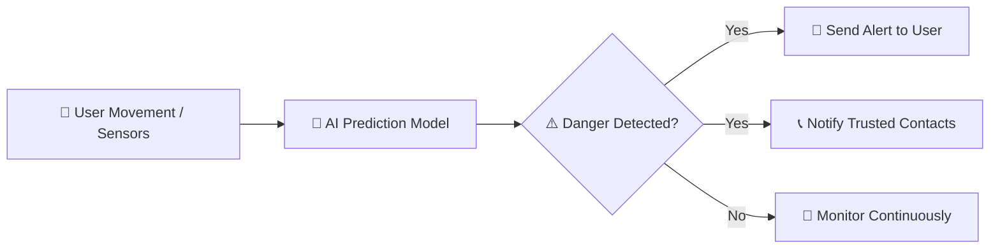

<p align="center">
  
</p>


**Velora** is an AI-powered safety app that predicts rising danger before it happens. Using phone sensors and behavioral analysis, it monitors subtle movement patterns and location context to provide early warnings, gentle alerts, and trusted contact notifications—all while keeping your data private and secure.

---

## 🚀 Features

- 💡 **AI Danger Prediction:** Detects unusual movement patterns and subtle behavioral changes  
- 🔔 **Real-Time Alerts:** Gentle warnings before danger escalates  
- 📞 **Trusted Contact Notification:** Notifies family or friends instantly  
- 🎨 **Interactive Dashboard:** Visualizes movement, alerts, and predictions  
- 🔒 **Data Privacy:** All sensitive information stays on your device  

---

## 🎨 Tech Stack

| Frontend          | Backend          | AI / ML                  | Database           |
|------------------|----------------|-------------------------|------------------|
| React.js / Expo  | Node.js / Express | Python ML Models         | MongoDB / Excel  |

---

## 🧩 How It Works



📁 Project Structure
```
velora/
├─ frontend/       # React.js app for user interface
├─ backend/        # Node.js/Express server
├─ ai_models/      # ML models for danger prediction
├─ data/           # Stored sensor data & reports
└─ README.md
```
🎯 Installation
bash
Copy code
```
# Clone the repo
git clone https://github.com/M-Nivetha7/Velora.git

# Navigate into project
cd velora

# Install frontend dependencies
cd frontend
npm install

# Install backend dependencies
cd ../backend
npm install

# Run the app (frontend & backend separately)
npm start # for frontend
npm run dev # for backend
🌟 Screenshots & Cute Animations
```

Interactive Dashboard


Early Danger Alert

🌸 Badges


🤝 Contributing
We welcome contributions!

Fork the repo

Create your feature branch (git checkout -b feature-name)

Commit your changes (git commit -m "Add feature")

Push to the branch (git push origin feature-name)

Open a Pull Request

💖 Support
If you like Velora, give it a ⭐ and share it with your friends!

⚠️ Disclaimer
Velora is designed to assist in personal safety, but cannot guarantee protection in all scenarios. Always stay aware of your surroundings.

yaml
Copy code


# AuraGuard
# Velora
